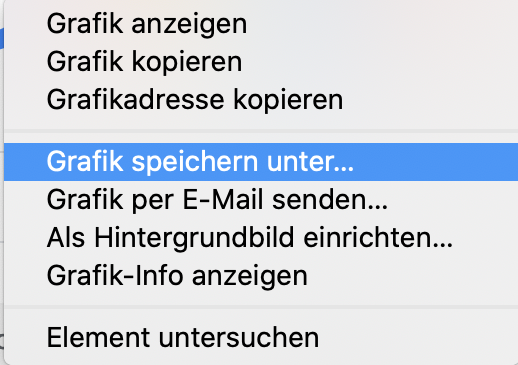

- Suche nach Bildern von dem, wovon du eine Darstellung brauchst.

- Wenn du ein passendes Bild findest, klicke darauf, um es in Originalgröße zu öffnen.

- Klicke mit der rechten Maustaste auf das Bild und wähle **Bild speichern unter ...**. Achte darauf, dass du nicht **Verknüpfung speichern unter ...** auswählst.

- Trage einen Kurznamen in das dafür vorgesehene Feld ein.

- Bevor Du auf **Speichern** klickst, notiere, in welchem Ordner deine Bilddatei gespeichert wird. Du müsst das Bild doch später finden können! Du kannst einen bestimmten Ordner auswählen, wenn du willst. Wenn du sicher bist, dass du das Bild wiederfindest, klicke auf **Speichern**.