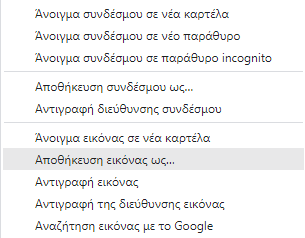

- Αναζήτηση για εικόνες του αντικειμένου που θέλετε μια εικόνα.

- Όταν βρεις μια εικόνα που σου αρέσει, κάνε κλικ πάνω της για να την ανοίξεις στο πλήρες μέγεθος.

- Στη συνέχεια, κάνε δεξί κλικ στην εικόνα, και επίλεξε **Αποθήκευση εικόνας ως...**. Βεβαιώσου ότι δεν έχεις επιλέξει **Αποθήκευση Συνδέσμου Ως...**.

- Πληκτρολόγησε ένα σύντομο όνομα στο κουτί που παρέχεται.

- Πριν κάνεις κλικ στο **Αποθήκευση**, σημείωσε σε ποιον φάκελο θα αποθηκευτεί το αρχείο εικόνας σου. Θα πρέπει να το θυμάσαι αυτό για να βρεις την εικόνα αργότερα! Μπορείς να επιλέξεις ένα συγκεκριμένο φάκελο αν το επιθυμείς. Όταν είσαι σίγουρος/η ότι θα βρεις ξανά την εικόνα, κάνε κλικ στο **Αποθήκευση**.