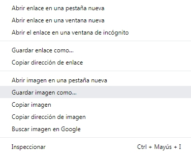

- Busca imágenes de lo que deseas.

- Cuando encuentres una imagen que te guste, haz clic en ella para abrirla a tamaño completo.

- Luego haz clic derecho en la imagen y selecciona **Guardar imagen como...**. Asegúrate de no haber seleccionado **Guardar enlace como...** (o un texto similar, depende del navegador que utilices).

- Escribe un nombre corto en el cuadro de diálogo que aparece.

- Antes de hacer clic en **Guardar**, apúntate la carpeta en la que se guardará tu archivo de imagen. ¡Más tarde tendrás que acordarte de esto para volver a encontrar la imagen! Puedes seleccionar una carpeta específica si lo deseas. Cuando estés seguro de que volverás a encontrar la imagen, haz clic en **Guardar**.