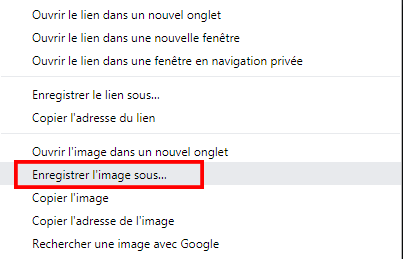

- Recherche des images de ce que tu souhaites avoir.

- Lorsque tu trouves une image que tu aimes, clique dessus pour l'ouvrir en taille réelle.

- Clique ensuite sur l’image avec le bouton droit de la souris et sélectionne **Enregistrer l'image sous ...**. Assures-toi de ne pas avoir sélectionné **Enregistrer le lien sous ...**.

- Tape un nom court dans la case prévue.

- Avant de cliquer sur **Enregistrer**, note dans quel dossier ton fichier image sera enregistré. Tu devras t'en souvenir pour retrouver l'image plus tard! Tu peux sélectionner un dossier spécifique si tu le souhaites. Lorsque tu es certain de retrouver l’image, clique sur **Enregistrer**.
