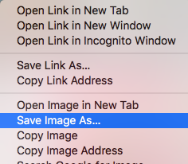

- Potražite stvari od kojih želite sliku.

- Kad pronađeš sliku koja ti se sviđa, klikni na nju da je otvoriš u punoj veličini.

- Zatim desnom tipkom miša klikni na sliku i odaberi **Spremi sliku kao... (Save Image As...)**. Pazi da ne odabereš **Spremi vezu kao... (Save Link As...)**.

- Unesi kratak naziv u okvir koji se pojavi.

- Prije nego što klikneš na **Spremi (Save)**, zapamti u koju će mapu biti spremljena tvoja slikovna datoteka. To ćeš morati zapamtiti kako bi kasnije pronašao/la sliku! Možeš odabrati određenu mapu ako želiš. Klikni na **Spremi (Save)** kada sa sigurnošću znaš gdje pronaći sliku.