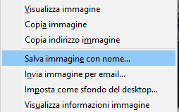

- Cerca le immagini di ciò di cui vuoi una foto.

- Quando trovi un'immagine che ti piace, fai clic su di essa per aprirla a schermo intero.

- Quindi fai clic con il pulsante destro del mouse sull'immagine e seleziona ** Salva immagine con nome... **. Assicurati di non aver selezionato **Salva collegamento come ...**.

- Digitare un nome breve nella casella fornita.

- Prima di fare clic su **Salva**, prendi nota della cartella in cui verrà salvato il file. Dovrai ricordarlo per trovare l'immagine in seguito! Se lo desideri, puoi selezionare una cartella specifica. Quando sei sicuro che troverai di nuovo l'immagine, fai clic su **Salva**.