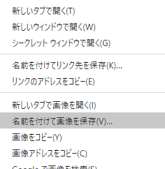

- 欲しい写真の画像を検索します。

- 気に入った画像が見つかったら、クリックして画像をフルサイズで開きます。

- 次に、画像を右クリックして、 **名前を付けて画像を保存...**を選択します。 選択したのが**名前を付けてリンク先を保存...**ではないことを確認してください。

- 表示されたボックスに短い名前を入力します。

- **保存**をクリックする前に、どのフォルダーに画像ファイルが保存されるのかメモします。 後で写真を見つけるために、これを覚えておく必要があります！ 必要に応じて、特定のフォルダーを選択することもできます。 画像を再び見つけられる確信が持てたら、 **保存**をクリックします。