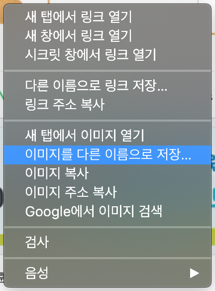

- 원하는 이미지를 검색하세요.

- 원하는 사진을 찾으면, 그것을 클릭하여 전체 크기로 여십시오.

- 그런 다음 사진을 마우스 오른쪽 단추로 클릭하고 **다른 이름으로 이미지 저장...** 을 선택하십시오. **다른 이름으로 링크 저장...** 을 클릭하지 않았는지 꼭 확인하세요!

- 입력창에 짧은 이름을 입력하세요.

- **저장**을 클릭하기 전에 이미지 파일이 저장 될 폴더를 기억하십시오. 나중에 사진을 찾으려면 위치를 기억해야 합니다! 원하는 경우 특정 폴더를 선택할 수 있습니다. 이미지를 다시 찾게되면 **저장**을 클릭하십시오.