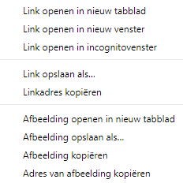

- Zoek naar plaatjes waarvan jij een foto wilt hebben.

- Wanneer je een foto vindt die jou bevalt, klik erop om hem op volledige grootte te openen.

- Klik vervolgens met de rechtermuisknop op de foto en selecteer **Afbeelding opslaan als...**. Zorg ervoor dat je niet **Link opslaan als...** hebt geselecteerd.

- Typ een korte naam in het daarvoor bestemde vak.

- Voordat je op **Opslaan** klikt, noteer je in welke map jouw afbeeldingsbestand wordt opgeslagen. Je moet dit onthouden om de foto later te vinden! Je kunt desgewenst een andere map selecteren. Als je zeker weet dat je de afbeelding terug kunt vinden, klikt je op **Opslaan**.
