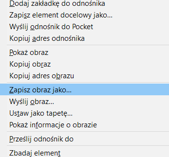

- Wyszukaj obrazy rzeczy, której chcesz zdjęcie.

- Gdy znajdziesz zdjęcie, które Ci się podoba, kliknij je, aby otworzyć w pełnym rozmiarze.

- Następnie kliknij zdjęcie prawym przyciskiem myszy i wybierz **Zapisz obraz jako...**. Upewnij się, że nie wybrano **Zapisz link jako...**.

- Wpisz krótką nazwę w odpowiednim polu.

- Przed kliknięciem **Zapisz** zanotuj, w którym folderze zostanie zapisany plik obrazu. Musisz to zapamiętać, aby później odnaleźć zdjęcie! Możesz wybrać konkretny folder, jeśli chcesz. Gdy będziesz pewien, że odnajdziesz zapisany obraz, kliknij **Zapisz**.