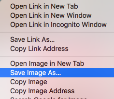

- Procure por imagens do que você deseja.

- Quando você encontrar uma imagem que goste, clique nela para abri-la em tamanho real.

- Então clique com o botão direito na imagem, e selecione a opção **Salvar imagem como ...**. Certifique-se que você não selecionou **Salvar link como ...** .

- Digite um nome abreviado no campo fornecido.

- Antes de clicar em **Salvar**, anote em qual pasta sua imagem será salva. Você precisará se lembrar disso para encontrar a imagem mais tarde! Você pode selecionar uma pasta específica, se desejar. Quando você tiver certeza de que encontrará a imagem novamente, clique em **Salvar**.