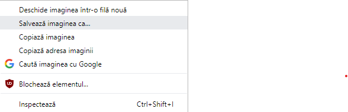

- Caută imagini cu ceea ce dorești.

- Când găsești o imagine care îți place, dă click pe ea pentru a o deschide la dimensiune maximă.

- Apoi dă click dreapta pe imagine și selectează **Salvează imaginea ca...**. Asigură-te că nu ai selectat **Salvează linkul ca...**.

- Introdu un nume scurt în caseta afișată.

- Înainte de a face clic pe **Salvează**, notează în ce folder va fi salvată imaginea ta. Va trebui să îți amintești acest lucru pentru a găsi imaginea mai târziu! Poți selecta un folder specific, dacă dorești. Când ești sigur că vei găsi imaginea din nou, dă click pe **Salvează**.