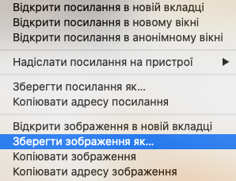

- Шукай картинку речі, яку треба показати.

- Знайшовши підходящу картинку, клацни по ній, щоб відкрити в повний розмір.

- Далі клацни правою кнопкою миші на зображенні та вибери **Зберегти зображення як...**. Переконайся, що ти не вибрав(-ла) **Зберегти посилання як...**.

- Введи коротке ім'я у надане поле.

- Перш ніж натиснути **Зберегти**, зверни увагу, в яку папку буде збережено файл зображення. Тобі потрібно її запам'ятати, щоб пізніше знайти свою картинку! Ти можеш вибрати якусь конкретну папку, якщо бажаєш. Коли ти впевнений, що зможеш знову знайти зображення, натисни **Зберегти**.